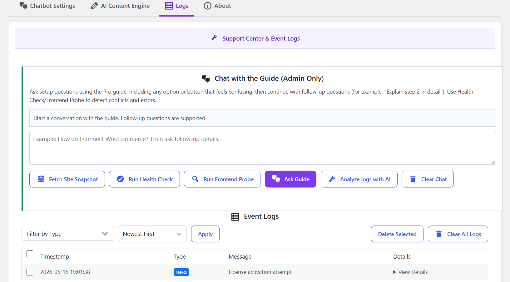

# Quorlyx

Free open-source AI chatbot and behavior automation plugin for WordPress and WooCommerce.

Quorlyx helps WordPress sites react to what visitors are doing: pages viewed, scroll depth, exit intent, cart activity, return visits, campaign source, product context, and conversion behavior. Instead of a static chatbot that waits for questions, Quorlyx can trigger useful AI-assisted messages and workflows at the right moment.

[Download on GitHub](https://github.com/mo1st/Quorlyx/) | [WordPress Marketplace](https://wordpress.org/plugins/quorlyx/) | [Website](https://quorlyx.dev) | [Community Support](https://discord.gg/ZTu6XFUZD)

## Why Quorlyx Exists

Most chatbot tools charge a recurring fee and keep the automation logic outside your site. Quorlyx runs inside WordPress, uses your own AI provider key, and gives developers, store owners, and agencies direct control over prompts, triggers, Knowledge Base sources, analytics, and cost behavior.

Use it to:

- Add an AI chatbot to WordPress and WooCommerce.
- Trigger messages from real visitor behavior.
- Use pages, posts, products, uploaded files, and rendered page text as Knowledge Base context.
- Track conversations, leads, goals, A/B tests, trigger performance, and content opportunities.
- Generate content, SEO ideas, schema, internal links, and WooCommerce product posts.
- Inspect, fork, modify, and extend the plugin without a vendor lock-in layer.

## Screenshots And GIFs

| Dashboard | Chat |
| --- | --- |
|  |  |

| Triggers | Content Insights |
| --- | --- |
|  |  |

| Goals | Cost Controls |
| --- | --- |
|  |  |

| SEO Tools | Logs |
| --- | --- |
|  |  |

## Core Features

- AI providers: Gemini, OpenAI, Anthropic Claude, Grok, Mistral, and DeepSeek.
- Chat widget with custom persona, welcome message, quick replies, action buttons, capture rules, and visual controls.
- Knowledge Base from posts, pages, products, public custom post types, rendered page text, current page text, and uploaded PDF/TXT/Markdown/CSV/JSON/HTML/XML files.
- WooCommerce context for products, carts, checkout behavior, coupons, product discovery, and purchase attribution.
- Behavior triggers for time on page, scroll depth, exit intent, inactivity, click intent, cart abandonment, return visitors, page depth, UTM/referrer, and conditional rules.
- Trigger priority, cooldowns, schedules, suppressions, recovery CTAs, cart-aware rules, and QA preview.
- A/B testing for chat variations, triggers, goals, conversion rates, and exports.
- Conversion goals for URLs, CSS selector clicks, form submits, common WordPress forms, WooCommerce actions, phone/email links, and downloads.
- Content Insights for public content, products, behavior patterns, opportunities, historical imports, and recommended actions.
- Behavior Pattern Engine for visitor classification, prediction, calibration, and reference matching.
- AI Content Engine for scheduled posts, product content, keyword queues, schema, SEO suggestions, and internal links.
- Logs, health checks, frontend probes, exports, reset tools, retention controls, caching, fallback provider, and model routing.

## Installation

### Option 1: GitHub

1. Download the latest release ZIP from [GitHub Releases](https://github.com/mo1st/Quorlyx/releases).
2. In WordPress admin, open **Plugins > Add New > Upload Plugin**.
3. Upload the ZIP and activate **Quorlyx**.
4. Open **Quorlyx > Settings**.
5. Add your own AI provider key and model.
6. Configure the chatbot, Knowledge Base sources, triggers, goals, and optional content tools.

### Option 2: Manual Install

1. Copy the `quorlyx` folder into `wp-content/plugins/`.
2. Activate **Quorlyx** from WordPress admin.
3. Open **Quorlyx > Settings** and connect your AI provider.

### Option 3: WordPress Marketplace

Use the basic plugin listing when available:

`https://wordpress.org/plugins/quorlyx/`

## Updates

Quorlyx includes a GitHub release updater for self-hosted installs.

- WordPress checks the latest public GitHub release.
- Updates appear in the normal WordPress **Dashboard > Updates** and **Plugins** screens.
- Admins can use **Check GitHub updates** from the plugin row.
- GitHub ZIP folders are normalized so the plugin stays installed as `wp-content/plugins/quorlyx/`.

## For Employers

Quorlyx is also a portfolio-grade engineering example. It demonstrates:

- WordPress plugin architecture across admin UI, frontend UI, AJAX, REST-style behavior, cron, exports, and persistence.
- AI product implementation with provider abstraction, prompt/context controls, fallback routing, caching, and cost controls.
- WooCommerce-aware automation using product, cart, checkout, and purchase signals.
- Analytics workflows with conversion goals, A/B tests, behavior events, CSV exports, and diagnostics.
- Security-minded open-source positioning: no committed secrets, no hidden install/domain tracking, and public issue-based support.
- Practical product judgment: the plugin is free, inspectable, and community-driven instead of locked behind a closed SaaS layer.

## Project Docs

- [Roadmap](ROADMAP.md)
- [Contributing](CONTRIBUTING.md)
- [Security](SECURITY.md)
- [Knowledge Base docs](docs/quorlyx-knowledge.md)
- [Knowledge Base upload docs](docs/quorlyx-knowledge-base-upload.md)
- [Persona templates](docs/quorlyx-persona-templates.md)

## Trust Notes

- Quorlyx uses the site owner's own AI provider keys.
- The plugin does not need a Quorlyx account to run.
- The project should not collect install domains silently.

## License

GPL-2.0-or-later.
